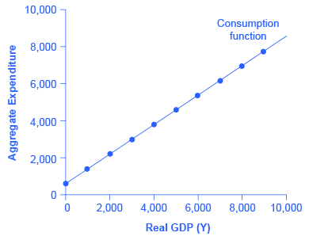
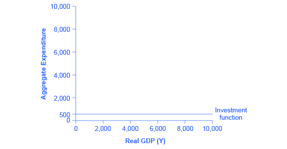
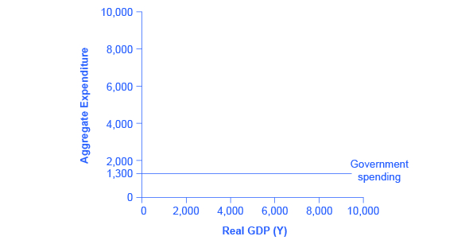
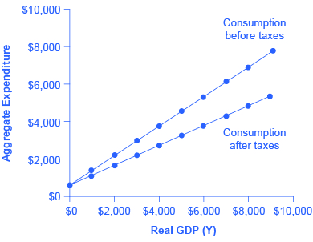
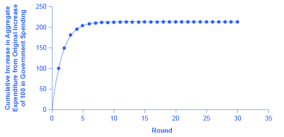
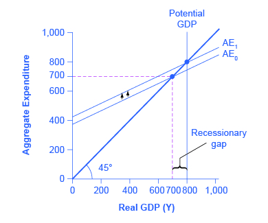
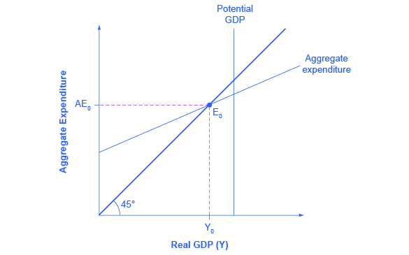
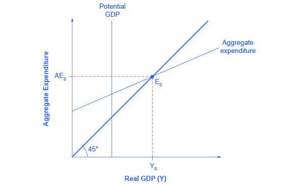

<?cnx.eoc class="summary" title="Chapter Review"?>

<?cnx.eoc class="self-check-questions" title="Self-Check Questions"?>

<?cnx.eoc class="review-questions" title="Review Questions"?>

<?cnx.eoc class="critical-thinking" title="Critical Thinking Questions"?>

<?cnx.eoc class="problems" title="Problems"?>

<?cnx.eoc class="references" title="References"?>

(This appendix should be consulted after first reading [The Aggregate Supply-Aggregate Demand Model](/m48739){: .target-chapter} and [The Keynesian Perspective](/m48749){: .target-chapter}.) The fundamental ideas of Keynesian economics were developed before the AS–AD model was popularized. From the 1930s until the 1970s, Keynesian economics was usually explained with a different model, known as the expenditure-output approach. This approach is strongly rooted in the fundamental assumptions of Keynesian economics: it focuses on the total amount of spending in the economy, with no explicit mention of aggregate supply or of the price level (although as you will see, it is possible to draw some inferences about aggregate supply and price levels based on the diagram).

# The Axes of the Expenditure-Output Diagram

The **expenditure-output model**{: data-type="term" .no-emphasis}, sometimes also called the **Keynesian cross diagram**{: data-type="term" .no-emphasis}, determines the equilibrium level of real GDP by the point where the total or aggregate expenditures in the economy are equal to the amount of output produced. The axes of the Keynesian cross diagram presented in [\[link\]](#CNX_Econ_C25_011) show real GDP on the horizontal axis as a measure of output and aggregate expenditures on the vertical axis as a measure of spending.

 {: #CNX_Econ_C25_011 data-media-type="image/jpeg" data-title="The Expenditure-Output Diagram "}

Remember that GDP can be thought of in several equivalent ways: it measures both the value of spending on final goods and also the value of the production of final goods. All sales of the final goods and services that make up GDP will eventually end up as income for workers, for managers, and for investors and owners of firms. The sum of all the income received for contributing resources to GDP is called **national income**{: data-type="term" .no-emphasis} (Y). At some points in the discussion that follows, it will be useful to refer to real GDP as “national income.” Both axes are measured in real (inflation-adjusted) terms.

**The Potential GDP Line and the 45-degree Line**

The Keynesian cross diagram contains two lines that serve as conceptual guideposts to orient the discussion. The first is a vertical line showing the level of **potential GDP**{: data-type="term" .no-emphasis}. Potential GDP means the same thing here that it means in the AS–AD diagrams: it refers to the quantity of output that the economy can produce with full employment of its labor and physical capital.

The second conceptual line on the Keynesian cross diagram is the 45-degree line, which starts at the origin and reaches up and to the right. A line that stretches up at a 45-degree angle represents the set of points (1, 1), (2, 2), (3, 3) and so on, where the measurement on the vertical axis is equal to the measurement on the horizontal axis. In this diagram, the 45-degree line shows the set of points where the level of aggregate expenditure in the economy, measured on the vertical axis, is equal to the level of output or national income in the economy, measured by GDP on the horizontal axis.

When the macroeconomy is in equilibrium, it must be true that the aggregate expenditures in the economy are equal to the **real GDP**{: data-type="term" .no-emphasis}—because by definition, GDP is the measure of what is spent on final sales of goods and services in the economy. Thus, the equilibrium calculated with a Keynesian cross diagram will always end up where aggregate expenditure and output are equal—which will only occur along the 45-degree line.

**The Aggregate Expenditure Schedule**

The final ingredient of the Keynesian cross or expenditure-output diagram is the **aggregate expenditure schedule**{: data-type="term" .no-emphasis}, which will show the total expenditures in the economy for each level of real GDP. The intersection of the aggregate expenditure line with the 45-degree line—at point E0 in [\[link\]](#CNX_Econ_C25_011)—will show the equilibrium for the economy, because it is the point where aggregate expenditure is equal to output or real GDP. After developing an understanding of what the aggregate expenditures schedule means, we will return to this equilibrium and how to interpret it.

# Building the Aggregate Expenditure Schedule

Aggregate expenditure is the key to the expenditure-income model. The aggregate expenditure schedule shows, either in the form of a table or a graph, how aggregate expenditures in the economy rise as real GDP or national income rises. Thus, in thinking about the components of the aggregate expenditure line—consumption, investment, government spending, exports and imports—the key question is how expenditures in each category will adjust as national income rises.

**Consumption as a Function of National Income**

How do consumption expenditures increase as national income rises? People can do two things with their income: consume it or save it (for the moment, let’s ignore the need to pay taxes with some of it). Each person who receives an additional dollar faces this choice. The **marginal propensity to consume (MPC)**{: data-type="term" .no-emphasis}, is the share of the additional dollar of income a person decides to devote to consumption expenditures. The **marginal propensity to save (MPS)**{: data-type="term" .no-emphasis} is the share of the additional dollar a person decides to save. It must always hold true that:

<math xmlns="http://www.w3.org/1998/Math/MathML"><mtext>MPC + MPS = 1</mtext></math>

For example, if the marginal propensity to consume out of the marginal amount of income earned is 0.9, then the marginal propensity to save is 0.1.

With this relationship in mind, consider the relationship among income, consumption, and savings shown in [\[link\]](#CNX_Econ_C25_012). (Note that we use “Aggregate Expenditure” on the vertical axis in this and the following figures, because all consumption expenditures are parts of aggregate expenditures.)

An assumption commonly made in this model is that even if income were zero, people would have to consume something. In this example, consumption would be $600 even if income were zero. Then, the MPC is 0.8 and the MPS is 0.2. Thus, when income increases by $1,000, consumption rises by $800 and savings rises by $200. At an income of $4,000, total consumption will be the $600 that would be consumed even without any income, plus $4,000 multiplied by the marginal propensity to consume of 0.8, or $ 3,200, for a total of $ 3,800. The total amount of consumption and saving must always add up to the total amount of income. (Exactly how a situation of zero income and negative savings would work in practice is not important, because even low-income societies are not literally at zero income, so the point is hypothetical.) This relationship between income and consumption, illustrated in [\[link\]](#CNX_Econ_C25_012) and [\[link\]](#Table_E_01), is called the **consumption function**{: data-type="term" .no-emphasis}.

 {: #CNX_Econ_C25_012 data-media-type="image/jpeg" data-title="The Consumption Function "}

The pattern of consumption shown in [\[link\]](#Table_E_01) is plotted in [\[link\]](#CNX_Econ_C25_012). To calculate consumption, multiply the income level by 0.8, for the marginal propensity to consume, and add $600, for the amount that would be consumed even if income was zero. Consumption plus savings must be equal to income.

<table id="Table_E_01" summary="The table shows the income, consumption, and savings data needed to calculate consumption. Column 1 lists Income. Column 2 lists Consumption. Column 3 lists Savings. Row 1: $0 (in income); $600 (in consumption); &#x2013;$600 (in savings). Row 2: $1,000 (in income); $1,400 (in consumption); &#x2013;$400 (in savings). Row 3: $2,000 (in income); $2,200 (in consumption); &#x2013;$200 (in savings). Row 4: $3,000 (in income); $3,000 (in consumption); $0 (in savings). Row 5: $4,000 (in income); $3,800 (in consumption); $200 (in savings). Row 6: $5,000 (in income); $4,600 (in consumption); $400 (in savings). Row 7: $6,000 (in income); $5,400 (in consumption); $600 (in savings). Row 8: $7,000 (in income); $6,200 (in consumption); $800 (in savings). Row 9: $8,000 (in income); $7,000 (in consumption); $1,000 (in savings). Row 10: $9,000 (in income); $7,800 (in consumption); $1,200 (in savings)."><caption>The Consumption Function</caption><thead>
<tr>
<th>Income</th>
<th>Consumption</th>
<th>Savings</th>
</tr>
</thead><tbody>
<tr>
<td>$0</td>
<td>	$600</td>
<td>–$600</td>
</tr>

<tr>
<td>$1,000</td>
<td>$1,400</td>
<td>–$400</td>
</tr>

<tr>
<td>$2,000</td>
<td>$2,200</td>
<td>–$200</td>
</tr>

<tr>
<td>$3,000</td>
<td>$3,000</td>
<td>$0</td>
</tr>
<tr>
<td>$4,000</td>
<td>$3,800</td>
<td>$200</td>
</tr>
<tr>
<td>$5,000</td>
<td>$4,600</td>
<td>$400</td>
</tr>
<tr>
<td>$6,000</td>
<td>$5,400</td>
<td>$600</td>
</tr>
<tr>
<td>$7,000</td>
<td>$6,200</td>
<td>$800</td>
</tr>
<tr>
<td>$8,000</td>
<td>$7,000</td>
<td>$1,000</td>
</tr>
<tr>
<td>$9,000</td>
<td>$7,800</td>
<td>	$1,200</td>
</tr>

      </tbody></table>

However, a number of factors other than income can also cause the entire consumption function to shift. These factors were summarized in the earlier discussion of consumption, and listed in [\[link\]](#Table_E_01). When the consumption function moves, it can shift in two ways: either the entire consumption function can move up or down in a parallel manner, or the slope of the consumption function can shift so that it becomes steeper or flatter. For example, if a tax cut leads consumers to spend more, but does not affect their marginal propensity to consume, it would cause an upward shift to a new consumption function that is parallel to the original one. However, a change in household preferences for saving that reduced the marginal propensity to save would cause the slope of the consumption function to become steeper: that is, if the savings rate is lower, then every increase in income leads to a larger rise in consumption.

**Investment as a Function of National Income**

Investment decisions are forward-looking, based on expected rates of return. Precisely because investment decisions depend primarily on perceptions about future economic conditions, they do *not* depend primarily on the level of GDP in the current year. Thus, on a Keynesian cross diagram, the investment function can be drawn as a horizontal line, at a fixed level of expenditure. [\[link\]](#CNX_Econ_C25_013) shows an investment function where the level of investment is, for the sake of concreteness, set at the specific level of 500. Just as a consumption function shows the relationship between consumption levels and real GDP (or national income), the **investment function**{: data-type="term" .no-emphasis} shows the relationship between investment levels and real GDP.

 {: #CNX_Econ_C25_013 data-media-type="image/jpeg" data-title="The Investment Function "}

The appearance of the investment function as a horizontal line does not mean that the level of investment never moves. It means only that in the context of this two-dimensional diagram, the level of investment on the vertical aggregate expenditure axis does not vary according to the current level of real GDP on the horizontal axis. However, all the other factors that vary investment—new technological opportunities, expectations about near-term economic growth, interest rates, the price of key inputs, and tax incentives for investment—can cause the horizontal investment function to shift up or down.

**Government Spending and Taxes as a Function of National Income**

In the Keynesian cross diagram, government spending appears as a horizontal line, as in [\[link\]](#CNX_Econ_C25_014), where government spending is set at a level of 1,300. As in the case of investment spending, this horizontal line does not mean that government spending is unchanging. It means only that government spending changes when Congress decides on a change in the budget, rather than shifting in a predictable way with the current size of the real GDP shown on the horizontal axis.

 {: #CNX_Econ_C25_014 data-media-type="image/jpeg" data-title="The Government Spending Function "}

The situation of taxes is different because taxes often rise or fall with the volume of economic activity. For example, income taxes are based on the level of income earned and sales taxes are based on the amount of sales made, and both income and sales tend to be higher when the economy is growing and lower when the economy is in a recession. For the purposes of constructing the basic Keynesian cross diagram, it is helpful to view taxes as a proportionate share of GDP. In the United States, for example, taking federal, state, and local taxes together, government typically collects about 30–35 % of income as taxes.

[\[link\]](#Table_E_02) revises the earlier table on the consumption function so that it takes taxes into account. The first column shows national income. The second column calculates taxes, which in this example are set at a rate of 30%, or 0.3. The third column shows after-tax income; that is, total income minus taxes. The fourth column then calculates consumption in the same manner as before: multiply after-tax income by 0.8, representing the marginal propensity to consume, and then add $600, for the amount that would be consumed even if income was zero. When taxes are included, the marginal propensity to consume is reduced by the amount of the tax rate, so each additional dollar of income results in a smaller increase in consumption than before taxes. For this reason, the consumption function, with taxes included, is flatter than the consumption function without taxes, as [\[link\]](#CNX_Econ_C25_015) shows.

 {: #CNX_Econ_C25_015 data-media-type="image/jpeg" data-title="The Consumption Function Before and After Taxes "}

<table id="Table_E_02" summary="The table shows the income, consumption, tax, and savings data needed to calculate consumption before and after taxes. Column 1 lists Income. Column 2 lists Taxes. Column 3 lists After-Tax Income. Column 4 lists Consumption. Column 5 lists Savings. Row 1: $0 (in income); $0 (in taxes); $0 (in after-tax income); $600 (in consumption); &#x2013;$600 (in savings). Row 2: $1,000 (in income); $300 (in taxes); $700 (in after-tax income) $1,160 (in consumption); &#x2013;$460 (in savings). Row 3: $2,000 (in income); $600 (in taxes); $1,400 (in after-tax income) $1,720 (in consumption); &#x2013;$320 (in savings). Row 4: $3,000 (in income); $900 (in taxes); $2,100 (in after-tax income) $2,280 (in consumption); &#x2013;$180 (in savings). Row 5: $4,000 (in income); $1,200 (in taxes); $2,800 (in after-tax income) $2,840 (in consumption); &#x2013;$40 (in savings). Row 6: $5,000 (in income); $1,500 (in taxes); $3,500 (in after-tax income) $3,400 (in consumption); $100 (in savings). Row 7: $6,000 (in income); $1,800 (in taxes); $4,200 (in after-tax income) $3,960 (in consumption); $240 (in savings). Row 8: $7,000 (in income); $2,100 (in taxes); $4,900 (in after-tax income) $4,520 (in consumption); $380 (in savings). Row 9: $8,000 (in income); $2,400 (in taxes); $5,600 (in after-tax income) $5,080 (in consumption); $520 (in savings). Row 10: $9,000 (in income); $2,700 (in taxes); $6,300 (in after-tax income) $5,640 (in consumption); $660 (in savings)."><caption>The Consumption Function Before and After Taxes</caption><thead>
<tr>
<th>Income</th>
<th>Taxes</th>
<th>After-Tax Income</th>
<th>Consumption</th>
<th>Savings</th>
</tr>
</thead><tbody>
<tr>
<td>$0</td>
<td>$0</td>
<td>$0</td>
<td>$600</td>
<td>–$600</td>
</tr>
<tr>
<td>$1,000</td>
<td>$300</td>
<td>$700</td>
<td>$1,160</td>
<td>–$460</td>
</tr>
<tr>
<td>$2,000</td>
<td>$600</td>
<td>$1,400</td>
<td>$1,720</td>
<td>–$320</td>
</tr>
<tr>
<td>$3,000</td>
<td>$900</td>
<td>$2,100</td>
<td>$2,280</td>
<td>–$180</td>
</tr>
<tr>
<td>$4,000</td>
<td>$1,200</td>
<td>$2,800</td>
<td>$2,840</td>
<td>–$40</td>
</tr>
<tr>
<td>$5,000</td>
<td>$1,500</td>
<td>$3,500</td>
<td>$3,400</td>
<td>$100</td>
</tr>
<tr>
<td>$6,000</td>
<td>$1,800</td>
<td>$4,200</td>
<td>$3,960</td>
<td>$240</td>
</tr>
<tr>
<td>$7,000</td>
<td>$2,100</td>
<td>$4,900</td>
<td>$4,520</td>
<td>$380</td>
</tr>
<tr>
<td>$8,000</td>
<td>$2,400</td>
<td>$5,600</td>
<td>$5,080</td>
<td>$520</td>
</tr>
<tr>
<td>$9,000</td>
<td>$2,700</td>
<td>$6,300</td>
<td>$5,640</td>
<td>$660</td>
</tr>

      </tbody></table>

**Exports and Imports as a Function of National Income**

The export function, which shows how exports change with the level of a country’s own real GDP, is drawn as a horizontal line, as in the example in [\[link\]](#CNX_Econ_C25_025) (a) where exports are drawn at a level of $840. Again, as in the case of investment spending and government spending, drawing the export function as horizontal does not imply that exports never change. It just means that they do not change because of what is on the horizontal axis—that is, a country’s own level of domestic production—and instead are shaped by the level of aggregate demand in other countries. More demand for exports from other countries would cause the export function to shift up; less demand for exports from other countries would cause it to shift down.

  The export function is drawn as a horizontal line because exports are determined by the buying power of other countries and thus do not change with the size of the domestic economy. In this example, exports are set at 840. However, exports can shift up or down, depending on buying patterns in other countries. (b) The import function is drawn in negative territory because expenditures on imported products are a subtraction from expenditures in the domestic economy. In this example, the marginal propensity to import is 0.1, so imports are calculated by multiplying the level of income by &#x2013;0.1."){: #CNX_Econ_C25_025 data-media-type="image/jpeg" data-title="The Export and Import Functions "}

Imports are drawn in the Keynesian cross diagram as a downward-sloping line, with the downward slope determined by the **marginal propensity to import (MPI)**{: data-type="term" .no-emphasis}, out of national income. In [\[link\]](#CNX_Econ_C25_025) (b), the marginal propensity to import is 0.1. Thus, if real GDP is $5,000, imports are $500; if national income is $6,000, imports are $600, and so on. The import function is drawn as downward sloping and negative, because it represents a subtraction from the aggregate expenditures in the domestic economy. A change in the marginal propensity to import, perhaps as a result of changes in preferences, would alter the slope of the import function.

Using an Algebraic Approach to the Expenditure-Output Model

In the expenditure-output or Keynesian cross model, the equilibrium occurs where the aggregate expenditure line (AE line) crosses the 45-degree line. Given algebraic equations for two lines, the point where they cross can be readily calculated. Imagine an economy with the following characteristics.

Y = Real GDP or national income

T = Taxes = 0.3Y

C = Consumption = 140 + 0.9(Y – T)

I = Investment = 400

G = Government spending = 800

X = Exports = 600

M = Imports = 0.15Y

Step 1. Determine the aggregate expenditure function. In this case, it is:

<math xmlns="http://www.w3.org/1998/Math/MathML"><mtable columnspacing="2px" columnalign="right center left"><mtr><mtd><mtext>AE</mtext></mtd><mtd><mtext> = </mtext></mtd><mtd><mtext>C + I + G + X – M</mtext></mtd></mtr><mtr><mtd><mtext>AE</mtext></mtd><mtd><mtext> = </mtext></mtd><mtd><mtext>140 + 0.9(Y – T) + 400 + 800 + 600 – 0.15Y</mtext></mtd></mtr></mtable></math>

Step 2. The equation for the 45-degree line is the set of points where GDP or national income on the horizontal axis is equal to aggregate expenditure on the vertical axis. Thus, the equation for the 45-degree line is: AE = Y.

Step 3. The next step is to solve these two equations for Y (or AE, since they will be equal to each other). Substitute Y for AE:

<math xmlns="http://www.w3.org/1998/Math/MathML"><mtable columnspacing="2px" columnalign="right center left"><mtr><mtd><mtext>Y</mtext></mtd><mtd><mtext> = </mtext></mtd><mtd><mtext>140 + 0.9(Y – T) + 400 + 800 + 600 – 0.15Y</mtext></mtd></mtr></mtable></math>

Step 4. Insert the term 0.3Y for the tax rate T. This produces an equation with only one variable, Y.

Step 5. Work through the algebra and solve for Y.

<math xmlns="http://www.w3.org/1998/Math/MathML"><mtable columnspacing="2px" columnalign="right center left"><mtr><mtd><mtext>Y</mtext></mtd><mtd><mtext> = </mtext></mtd><mtd><mtext>140 + 0.9(Y – 0.3Y) + 400 + 800 + 600 – 0.15Y</mtext></mtd></mtr><mtr><mtd><mtext>Y</mtext></mtd><mtd><mtext> = </mtext></mtd><mtd><mtext>140 + 0.9Y – 0.27Y + 1800 – 0.15Y</mtext></mtd></mtr><mtr><mtd><mtext>Y</mtext></mtd><mtd><mtext> = </mtext></mtd><mtd><mtext>1940 + 0.48Y</mtext></mtd></mtr><mtr><mtd><mtext>Y – 0.48Y</mtext></mtd><mtd><mtext> = </mtext></mtd><mtd><mtext>1940</mtext></mtd></mtr><mtr><mtd><mtext>0.52Y</mtext></mtd><mtd><mtext> = </mtext></mtd><mtd><mtext>1940</mtext></mtd></mtr><mtr><mtd><mfrac><mtext>0.52Y</mtext><mtext>0.52</mtext></mfrac></mtd><mtd><mtext> = </mtext></mtd><mtd><mfrac><mtext>1940</mtext><mtext>0.52</mtext></mfrac></mtd></mtr><mtr><mtd><mtext>Y</mtext></mtd><mtd><mtext> = </mtext></mtd><mtd><mtext>3730</mtext></mtd></mtr></mtable></math>

This algebraic framework is flexible and useful in predicting how economic events and policy actions will affect real GDP.

Step 6. Say, for example, that because of changes in the relative prices of domestic and foreign goods, the marginal propensity to import falls to 0.1. Calculate the equilibrium output when the marginal propensity to import is changed to 0.1.

<math xmlns="http://www.w3.org/1998/Math/MathML"><mtable columnspacing="2px" columnalign="right center left"><mtr><mtd><mtext>Y</mtext></mtd><mtd><mtext> = </mtext></mtd><mtd><mtext>140 + 0.9(Y – 0.3Y) + 400 + 800 + 600 – 0.1Y</mtext></mtd></mtr><mtr><mtd><mtext>Y</mtext></mtd><mtd><mtext> = </mtext></mtd><mtd><mtext>1940 – 0.53Y</mtext></mtd></mtr><mtr><mtd><mtext>0.47Y</mtext></mtd><mtd><mtext> = </mtext></mtd><mtd><mtext>1940</mtext></mtd></mtr><mtr><mtd><mtext>Y</mtext></mtd><mtd><mtext> = </mtext></mtd><mtd><mtext>4127</mtext></mtd></mtr></mtable></math>

Step 7. Because of a surge of business confidence, investment rises to 500. Calculate the equilibrium output.

<math xmlns="http://www.w3.org/1998/Math/MathML"><mtable columnspacing="2px" columnalign="right center left"><mtr><mtd><mtext>Y</mtext></mtd><mtd><mtext> = </mtext></mtd><mtd><mtext>140 + 0.9(Y – 0.3Y) + 500 + 800 + 600 – 0.15Y </mtext></mtd></mtr><mtr><mtd><mtext>Y</mtext></mtd><mtd><mtext> = </mtext></mtd><mtd><mtext>2040 + 0.48Y</mtext></mtd></mtr><mtr><mtd><mtext>Y – 0.48Y</mtext></mtd><mtd><mtext> = </mtext></mtd><mtd><mtext>2040</mtext></mtd></mtr><mtr><mtd><mtext>0.52Y</mtext></mtd><mtd><mtext> = </mtext></mtd><mtd><mtext>2040</mtext></mtd></mtr><mtr><mtd><mtext>Y</mtext></mtd><mtd><mtext> = </mtext></mtd><mtd><mtext>3923</mtext></mtd></mtr></mtable></math>

For issues of policy, the key questions would be how to adjust government spending levels or tax rates so that the equilibrium level of output is the full employment level. In this case, let the economic parameters be:

Y = National income

T = Taxes = 0.3Y

C = Consumption = 200 + 0.9(Y – T)

I = Investment = 600

G = Government spending = 1,000

X = Exports = 600

Y = Imports = 0.1(Y – T)

Step 8. Calculate the equilibrium for this economy (remember Y + AE).

<math xmlns="http://www.w3.org/1998/Math/MathML"><mtable columnspacing="2px" columnalign="right center left"><mtr><mtd><mtext>Y</mtext></mtd><mtd><mtext> = </mtext></mtd><mtd><mtext>200 + 0.9(Y – 0.3Y) + 600 + 1000 + 600 – 0.1(Y – 0.3Y)</mtext></mtd></mtr><mtr><mtd><mtext>Y – 0.63Y + 0.07Y</mtext></mtd><mtd><mtext> = </mtext></mtd><mtd><mtext>2400</mtext></mtd></mtr><mtr><mtd><mtext>0.44Y</mtext></mtd><mtd><mtext> = </mtext></mtd><mtd><mtext>2400</mtext></mtd></mtr><mtr><mtd><mtext>Y</mtext></mtd><mtd><mtext> = </mtext></mtd><mtd><mtext>5454</mtext></mtd></mtr></mtable></math>

Step 9. Assume that the full employment level of output is 6,000. What level of government spending would be necessary to reach that level? To answer this question, plug in 6,000 as equal to Y, but leave G as a variable, and solve for G. Thus:

<math xmlns="http://www.w3.org/1998/Math/MathML"><mtext>6000 = 200 + 0.9(6000 – 0.3(6000)) + 600 + G + 600 – 0.1(6000 – 0.3(6000))</mtext></math>

Step 10. Solve this problem arithmetically. The answer is: G = 1,240. In other words, increasing government spending by 240, from its original level of 1,000, to 1,240, would raise output to the full employment level of GDP.

Indeed, the question of how much to increase government spending so that equilibrium output will rise from 5,454 to 6,000 can be answered without working through the algebra, just by using the multiplier formula. The multiplier equation in this case is:

<math xmlns="http://www.w3.org/1998/Math/MathML"><mtable columnspacing="2px" columnalign="right center left"><mtr><mtd><mfrac><mtext>1</mtext><mtext>1 – 0.56</mtext></mfrac></mtd><mtd><mtext> = </mtext></mtd><mtd><mtext>2.27</mtext></mtd></mtr></mtable><mtable columnspacing="2px" columnalign="left"><mtr /><mtr /><mtr /><mtr /></mtable><mspace linebreak="newline" /></math>

Thus, to raise output by 546 would require an increase in government spending of 546/2.27=240, which is the same as the answer derived from the algebraic calculation.

This algebraic framework is highly flexible. For example, taxes can be treated as a total set by political considerations (like government spending) and not dependent on national income. Imports might be based on before-tax income, not after-tax income. For certain purposes, it may be helpful to analyze the economy without exports and imports. A more complicated approach could divide up consumption, investment, government, exports and imports into smaller categories, or to build in some variability in the rates of taxes, savings, and imports. A wise economist will shape the model to fit the specific question under investigation.

**Building the Combined Aggregate Expenditure Function**

All the components of **aggregate demand**{: data-type="term" .no-emphasis}—consumption, investment, government spending, and the trade balance—are now in place to build the Keynesian cross diagram. [\[link\]](#CNX_Econ_C25_018) builds up an aggregate expenditure function, based on the numerical illustrations of C, I, G, X, and M that have been used throughout this text. The first three columns in [\[link\]](#Table_E_03) are lifted from the earlier [\[link\]](#Table_E_02), which showed how to bring taxes into the consumption function. The first column is real GDP or national income, which is what appears on the horizontal axis of the income-expenditure diagram. The second column calculates after-tax income, based on the assumption, in this case, that 30% of real GDP is collected in taxes. The third column is based on an MPC of 0.8, so that as after-tax income rises by $700 from one row to the next, consumption rises by $560 (700 × 0.8) from one row to the next. Investment, government spending, and exports do not change with the level of current national income. In the previous discussion, investment was $500, government spending was $1,300, and exports were $840, for a total of $2,640. This total is shown in the fourth column. Imports are 0.1 of real GDP in this example, and the level of imports is calculated in the fifth column. The final column, **aggregate expenditures**{: data-type="term" .no-emphasis}, sums up C + I + G + X – M. This **aggregate expenditure line**{: data-type="term" .no-emphasis} is illustrated in [\[link\]](#CNX_Econ_C25_018).

  is graphed. The equilibrium occurs where aggregate expenditure is equal to national income; this occurs where the aggregate expenditure schedule crosses the 45-degree line, at a real GDP of $6,000. Potential GDP in this example is $7,000, so the equilibrium is occurring at a level of output or real GDP below the potential GDP level."){: #CNX_Econ_C25_018 data-media-type="image/jpeg" data-title="A Keynesian Cross Diagram "}

<table id="Table_E_03" summary="The table shows the data for national income-aggregate expenditure equilibrium. Column 1 lists National Income. Column 2 lists After-Tax Income. Column 3 lists Consumption. Column 4 lists Government Spending + Investment + Exports. Column 5 lists Imports. Column 6 lists Aggregate Expenditure. Row 1: $3,000; $2,100; $2,280; $2,640; $300; $4,620. Row 2: $4,000; $2,800; $2,840; $2,640; $400; $5,080. Row 3: $5,000; $3,500; $3,400; $2,640; $500; $5,540. Row 4: $6,000; $4,200; $3,960; $2,640; $600; $6,000. Row 5: $7,000; $4,900; $4,520; $2,640; $700; $6,460. Row 6: $8,000; $5,600; $5,080; $2,640; $800; $6,920. Row 7: $9,000; $6,300; $5,640; $2,640; $900; $7,380."><caption>National Income-Aggregate Expenditure Equilibrium</caption><thead>
<tr>
<th>National Income</th>
<th>After-Tax Income</th>
<th>Consumption</th>
<th>Government Spending + Investment + Exports</th>
<th>Imports</th>
<th>Aggregate Expenditure</th>
</tr>
</thead><tbody>
<tr>
<td>$3,000</td>
<td>$2,100</td>
<td>$2,280</td>
<td>$2,640</td>
<td>$300</td>
<td>$4,620</td>
</tr>
<tr>
<td>$4,000</td>
<td>$2,800</td>
<td>$2,840</td>
<td>$2,640</td>
<td>$400</td>
<td>$5,080</td>
</tr>
<tr>
<td>$5,000</td>
<td>$3,500</td>
<td>$3,400</td>
<td>$2,640</td>
<td>$500</td>
<td>$5,540</td>
</tr>
<tr>
<td>$6,000</td>
<td>$4,200</td>
<td>$3,960</td>
<td>$2,640</td>
<td>$600</td>
<td>$6,000</td>
</tr>
<tr>
<td>$7,000</td>
<td>$4,900</td>
<td>$4,520</td>
<td>$2,640</td>
<td>$700</td>
<td>$6,460</td>
</tr>
<tr>
<td>$8,000</td>
<td>$5,600</td>
<td>$5,080</td>
<td>$2,640</td>
<td>$800</td>
<td>$6,920</td>
</tr>
<tr>
<td>$9,000</td>
<td>$6,300</td>
<td>$5,640</td>
<td>$2,640</td>
<td>$900</td>
<td>$7,380</td>
</tr>

      </tbody></table>

The **aggregate expenditure function**{: data-type="term" .no-emphasis} is formed by stacking on top of each other the consumption function (after taxes), the investment function, the government spending function, the export function, and the import function. The point at which the aggregate expenditure function intersects the vertical axis will be determined by the levels of investment, government, and export expenditures—which do not vary with national income. The upward slope of the aggregate expenditure function will be determined by the marginal propensity to save, the tax rate, and the marginal propensity to import. A higher marginal propensity to save, a higher tax rate, and a higher marginal propensity to import will all make the slope of the aggregate expenditure function flatter—because out of any extra income, more is going to savings or taxes or imports and less to spending on domestic goods and services.

The equilibrium occurs where national income is equal to aggregate expenditure, which is shown on the graph as the point where the aggregate expenditure schedule crosses the 45-degree line. In this example, the equilibrium occurs at 6,000. This equilibrium can also be read off the table under the figure; it is the level of national income where aggregate expenditure is equal to national income.

# Equilibrium in the Keynesian Cross Model

With the aggregate expenditure line in place, the next step is to relate it to the two other elements of the Keynesian cross diagram. Thus, the first subsection interprets the intersection of the aggregate expenditure function and the 45-degree line, while the next subsection relates this point of intersection to the potential GDP line.

**Where Equilibrium Occurs**

The point where the aggregate expenditure line that is constructed from C + I + G + X – M crosses the 45-degree line will be the equilibrium for the economy. It is the only point on the aggregate expenditure line where the total amount being spent on aggregate demand equals the total level of production. In [\[link\]](#CNX_Econ_C25_018), this point of equilibrium (E0) happens at 6,000, which can also be read off [\[link\]](#Table_E_03).

The meaning of “equilibrium” remains the same; that is, **equilibrium**{: data-type="term" .no-emphasis} is a point of balance where no incentive exists to shift away from that outcome. To understand why the point of intersection between the aggregate expenditure function and the 45-degree line is a macroeconomic equilibrium, consider what would happen if an economy found itself to the right of the equilibrium point E, say point H in [\[link\]](#CNX_Econ_C25_019), where output is higher than the equilibrium. At point H, the level of aggregate expenditure is below the 45-degree line, so that the level of aggregate expenditure in the economy is less than the level of output. As a result, at point H, output is piling up unsold—not a sustainable state of affairs.

  must lie on the 45-degree line, which is the set of points where national income and aggregate expenditure are equal."){: #CNX_Econ_C25_019 data-media-type="image/jpeg" data-title="Equilibrium in the Keynesian Cross Diagram "}

Conversely, consider the situation where the level of output is at point L—where real output is lower than the equilibrium. In that case, the level of aggregate demand in the economy is above the 45-degree line, indicating that the level of aggregate expenditure in the economy is greater than the level of output. When the level of aggregate demand has emptied the store shelves, it cannot be sustained, either. Firms will respond by increasing their level of production. Thus, the equilibrium must be the point where the amount produced and the amount spent are in balance, at the intersection of the aggregate expenditure function and the 45-degree line.

Finding Equilibrium

[\[link\]](#Table_E_04) gives some information on an economy. The Keynesian model assumes that there is some level of consumption even without income. That amount is $236 – $216 = $20. $20 will be consumed when national income equals zero. Assume that taxes are 0.2 of real GDP. Let the marginal propensity to save of after-tax income be 0.1. The level of investment is $70, the level of government spending is $80, and the level of exports is $50. Imports are 0.2 of after-tax income. Given these values, you need to complete [\[link\]](#Table_E_04) and then answer these questions:  What is the consumption function? What is the equilibrium? Why is a national income of $300 not at equilibrium? How do expenditures and output compare at this point? 

| National Income | Taxes | After-tax income | Consumption | I + G + X | Imports | Aggregate Expenditures |
|----------
| $300 |  |  | $236 |  |  |  |
| $400 |  |  |  |  |  |  |
| $500 |  |  |  |  |  |  |
| $600 |  |  |  |  |  |  |
| $700 |  |  |  |  |  |  |
{: #Table_E_04 summary="The table shows information needed to find equilibrium, as well as space for filling in the final values. Column 1 lists National Income. Column 2 lists Taxes. Column 3 lists After-Tax Income. Column 4 lists Consumption. Column 5 lists I+G+X. Column 6 lists Imports. Column 7 lists Aggregate Expenditures. Column 1 has the following values filled in: $300, $400, $500, $600, $700. Column 4, row 1 = $236. All other cells are empty"}

Step 1. Calculate the amount of taxes for each level of national income(reminder: GDP = national income) for each level of national income using the following as an example:

<math xmlns="http://www.w3.org/1998/Math/MathML"><mtable columnalign="left center center right"><mtr><mtd><mtext>National Income (Y)</mtext></mtd><mtd /><mtd /><mtd><mtext>$300</mtext></mtd></mtr><mtr><mtd><mtext>Taxes = 0.2 or 20%</mtext></mtd><mtd /><mtd /><mtd><mtext>× 0.2</mtext></mtd></mtr><mtr><mtd><mtext>Tax amount (T)</mtext></mtd><mtd /><mtd /><mtd><mtext>$60</mtext></mtd></mtr></mtable></math>

Step 2. Calculate after-tax income by subtracting the tax amount from national income for each level of national income using the following as an example:

<math xmlns="http://www.w3.org/1998/Math/MathML"><mtable columnalign="left center center left"><mtr><mtd><mtext>National income minus taxes</mtext></mtd><mtd /><mtd /><mtd><mtext>$300</mtext></mtd></mtr><mtr><mtd /><mtd /><mtd /><mtd><mtext>–$60</mtext></mtd></mtr><mtr><mtd><mtext>After-tax income</mtext></mtd><mtd /><mtd /><mtd><mtext>$240</mtext></mtd></mtr></mtable></math>

Step 3. Calculate consumption. The marginal propensity to save is given as 0.1. This means that the marginal propensity to consume is 0.9, since MPS + MPC = 1. Therefore, multiply 0.9 by the after-tax income amount using the following as an example:

<math xmlns="http://www.w3.org/1998/Math/MathML"><mtable columnalign="left center center right"><mtr><mtd><mtext>After-tax Income</mtext></mtd><mtd /><mtd /><mtd><mtext>$240</mtext></mtd></mtr><mtr><mtd><mtext>MPC</mtext></mtd><mtd /><mtd /><mtd><mtext>× 0.9</mtext></mtd></mtr><mtr><mtd><mtext>Consumption</mtext></mtd><mtd /><mtd /><mtd><mtext>$216</mtext></mtd></mtr></mtable></math>

Step 4. Consider why the table shows consumption of $236 in the first row. As mentioned earlier, the Keynesian model assumes that there is some level of consumption even without income. That amount is $236 – $216 = $20.

Step 5. There is now enough information to write the consumption function. The consumption function is found by figuring out the level of consumption that will happen when income is zero. Remember that:

<math xmlns="http://www.w3.org/1998/Math/MathML"><mtext>C = Consumption when national income is zero + MPC (after-tax income)</mtext></math>

Let C represent the consumption function, Y represent national income, and T represent taxes.

<math xmlns="http://www.w3.org/1998/Math/MathML"><mtable columnspacing="2px" columnalign="right center left"><mtr><mtd><mtext>C</mtext></mtd><mtd><mtext> = </mtext></mtd><mtd><mtext>$20 + 0.9(Y – T)</mtext></mtd></mtr><mtr><mtd /><mtd><mtext> = </mtext></mtd><mtd><mtext>$20 + 0.9($300 – $60)</mtext></mtd></mtr><mtr><mtd /><mtd><mtext> = </mtext></mtd><mtd><mtext>$236</mtext></mtd></mtr></mtable></math>

Step 6. Use the consumption function to find consumption at each level of national income.

Step 7. Add investment (I), government spending (G), and exports (X). Remember that these do not change as national income changes:

Step 8. Find imports, which are 0.2 of after-tax income at each level of national income. For example:

<math xmlns="http://www.w3.org/1998/Math/MathML"><mtable columnalign="left center center right"><mtr><mtd><mtext>After-tax income</mtext></mtd><mtd /><mtd /><mtd><mtext>$240</mtext></mtd></mtr><mtr><mtd><mtext>Imports of 0.2 or 20% of Y – T</mtext></mtd><mtd /><mtd /><mtd><mtext>× 0.2</mtext></mtd></mtr><mtr><mtd><mtext>Imports</mtext></mtd><mtd /><mtd /><mtd><mtext>$48</mtext></mtd></mtr></mtable></math>

Step 9. Find aggregate expenditure by adding C + I + G + X – I for each level of national income. Your completed table should look like [\[link\]](#Table_E_05).

<table id="Table_E_05" summary="The table shows that equilibrium occurs where national income equals aggregate expenditure at $500 (in The equilibrium level is italicized). Column 1 lists National Income (in Y). Column 2 lists Tax = 0.2 &#xD7; Y (in T). Column 3 lists After-Tax Income (in Y &#x2013; T). Column 4 lists Consumption C=$20+0.9(in Y&#x2013;T). Column 5 lists I+G+X. Column 6 lists Minus Imports (in M). Column 7 lists Aggregate Expenditures AE = C+I+G+X&#x2013;M. Row 1: $300; $60; $240; $236; $200; $48; $388. Row 2: $400; $80; $320; $308; $200; $64; $444. Row 3 (this row is italicized): $500; $100; $400; $380; $200; $80; $500. Row 4: $600; $120; $480; $452; $200; $96; $556. Row 5: $700; $140; $560; $524; $200; $112; $612."><caption></caption><thead>
<tr>
<th>National Income (Y)</th>
<th>Tax = 0.2 × Y (T)</th>
<th>After-tax income (Y – T)</th>
<th>Consumption C = $20 + 0.9(Y – T)</th>
<th>I + G + X</th>
<th>Minus Imports (M)</th>
<th>Aggregate Expenditures AE = C + I + G + X – M</th>
</tr>
</thead><tbody>
<tr>
<td>$300</td>
<td>$60</td>
<td>$240</td>
<td>$236</td>
<td>$200</td>
<td>$48</td>
<td>$388</td>
</tr>
<tr>
<td>$400</td>
<td>$80</td>
<td>$320</td>
<td>$308</td>
<td>$200</td>
<td>$64</td>
<td>$444</td>
</tr>
<tr>
<td><em>$500</em></td>
<td><em>$100</em></td>
<td><em>$400</em></td>
<td><em>$380</em></td>
<td><em>$200</em></td>
<td><em>$80</em></td>
<td><em>$500</em></td>
</tr>
<tr>
<td>$600</td>
<td>$120</td>
<td>$480</td>
<td>$452</td>
<td>$200</td>
<td>$96</td>
<td>$556</td>
</tr>
<tr>
<td>$700</td>
<td>$140</td>
<td>$560</td>
<td>$524</td>
<td>$200</td>
<td>$112</td>
<td>$612</td>
</tr>

      </tbody></table>
Step 10. Answer the question: What is equilibrium? Equilibrium occurs where AE = Y. [\[link\]](#Table_E_05) shows that equilibrium occurs where national income equals aggregate expenditure at $500.

Step 11. Find equilibrium mathematically, knowing that national income is equal to aggregate expenditure.

<math xmlns="http://www.w3.org/1998/Math/MathML"><mtable columnspacing="2px 2px 2px 2px" columnalign="left left left left"><mtr><mtd><mtext>Y</mtext></mtd><mtd><mtext> = </mtext></mtd><mtd><mtext>AE</mtext></mtd><mtd><mspace /></mtd></mtr><mtr><mtd /><mtd><mtext> = </mtext></mtd><mtd><mtext>C + I + G + X – M</mtext></mtd><mtd><mspace /></mtd></mtr><mtr><mtd /><mtd><mtext> = </mtext></mtd><mtd><mtext>$20 + 0.9(Y – T) + $70 + $80 + $50 – 0.2(Y – T)</mtext></mtd><mtd /></mtr><mtr><mtd /><mtd><mtext> = </mtext></mtd><mtd><mtext>$220 + 0.9(Y – T) – 0.2(Y – T)</mtext></mtd><mtd><mspace /></mtd></mtr><mtr><mtd /><mtd /><mtd /><mtd><mspace /></mtd></mtr></mtable></math>

Since T is 0.2 of national income, substitute T with 0.2 Y so that:

<math xmlns="http://www.w3.org/1998/Math/MathML"><mtable columnspacing="2px 2px 2px 2px" columnalign="left left left left"><mtr><mtd><mtext>Y</mtext></mtd><mtd><mtext> = </mtext></mtd><mtd><mtext>$220 + 0.9(Y – 0.2Y) – 0.2(Y – 0.2Y)</mtext></mtd><mtd><mspace /></mtd></mtr><mtr><mtd /><mtd><mtext> = </mtext></mtd><mtd><mtext>$220 + 0.9Y – 0.18Y – 0.2Y + 0.04Y</mtext></mtd><mtd><mspace /></mtd></mtr><mtr><mtd /><mtd><mtext> = </mtext></mtd><mtd><mtext>$220 + 0.56Y</mtext></mtd><mtd /></mtr><mtr><mtd /><mtd /><mtd /><mtd><mspace /></mtd></mtr><mtr><mtd /><mtd /><mtd /><mtd><mspace /></mtd></mtr></mtable></math>

Solve for Y.

<math xmlns="http://www.w3.org/1998/Math/MathML"><mtable columnspacing="2px 2px 2px" columnalign="right center left"><mtr><mtd><mtext>Y</mtext></mtd><mtd><mtext> = </mtext></mtd><mtd><mtext>$220 + 0.56Y</mtext></mtd></mtr><mtr><mtd><mtext>Y – 0.56Y</mtext></mtd><mtd><mtext> = </mtext></mtd><mtd><mtext>$220</mtext></mtd></mtr><mtr><mtd><mtext>0.44Y</mtext></mtd><mtd><mtext> = </mtext></mtd><mtd><mtext>$220</mtext></mtd></mtr><mtr><mtd><mfrac><mtext>0.44Y</mtext><mtext>0.44</mtext></mfrac></mtd><mtd><mtext> = </mtext></mtd><mtd><mfrac><mtext>$220</mtext><mtext>0.44</mtext></mfrac></mtd></mtr><mtr><mtd><mtext>Y</mtext></mtd><mtd><mtext> = </mtext></mtd><mtd><mtext>$500</mtext></mtd></mtr></mtable></math>

Step 12. Answer this question: Why is a national income of $300 not an equilibrium? At national income of $300, aggregate expenditures are $388.

Step 13. Answer this question: How do expenditures and output compare at this point? Aggregate expenditures cannot exceed output (GDP) in the long run, since there would not be enough goods to be bought.

**Recessionary and Inflationary Gaps**

In the Keynesian cross diagram, if the aggregate expenditure line intersects the 45-degree line at the level of potential GDP, then the economy is in sound shape. There is no recession, and unemployment is low. But there is no guarantee that the equilibrium will occur at the potential GDP level of output. The equilibrium might be higher or lower.

For example, [\[link\]](#CNX_Econ_C25_026) (a) illustrates a situation where the aggregate expenditure line intersects the 45-degree line at point E0, which is a real GDP of $6,000, and which is below the potential GDP of $7,000. In this situation, the level of aggregate expenditure is too low for GDP to reach its full employment level, and unemployment will occur. The distance between an output level like E0 that is below potential GDP and the level of potential GDP is called a **recessionary gap**{: data-type="term" .no-emphasis}. Because the equilibrium level of real GDP is so low, firms will not wish to hire the full employment number of workers, and unemployment will be high.

  If the equilibrium occurs at an output below potential GDP, then a recessionary gap exists. The policy solution to a recessionary gap is to shift the aggregate expenditure schedule up from AE0 to AE1, using policies like tax cuts or government spending increases. Then the new equilibrium E1 occurs at potential GDP. (b) If the equilibrium occurs at an output above potential GDP, then an inflationary gap exists. The policy solution to an inflationary gap is to shift the aggregate expenditure schedule down from AE0 to AE1, using policies like tax increases or spending cuts. Then, the new equilibrium E1 occurs at potential GDP."){: #CNX_Econ_C25_026 data-media-type="image/jpeg" data-title="Addressing Recessionary and Inflationary Gaps "}

What might cause a recessionary gap? Anything that shifts the aggregate expenditure line down is a potential cause of recession, including a decline in consumption, a rise in savings, a fall in investment, a drop in government spending or a rise in taxes, or a fall in exports or a rise in imports. Moreover, an economy that is at equilibrium with a recessionary gap may just stay there and suffer high unemployment for a long time; remember, the meaning of equilibrium is that there is no particular adjustment of prices or quantities in the economy to chase the recession away.

The appropriate response to a recessionary gap is for the government to reduce taxes or increase spending so that the aggregate expenditure function shifts up from AE0 to AE1. When this shift occurs, the new equilibrium E1 now occurs at potential GDP as shown in [\[link\]](#CNX_Econ_C25_026) (a).

Conversely, [\[link\]](#CNX_Econ_C25_026) (b) shows a situation where the aggregate expenditure schedule (AE0) intersects the 45-degree line above potential GDP. The gap between the level of real GDP at the equilibrium E0 and potential GDP is called an **inflationary gap**{: data-type="term" .no-emphasis}. The inflationary gap also requires a bit of interpreting. After all, a naïve reading of the Keynesian cross diagram might suggest that if the aggregate expenditure function is just pushed up high enough, real GDP can be as large as desired—even doubling or tripling the potential GDP level of the economy. This implication is clearly wrong. An economy faces some supply-side limits on how much it can produce at a given time with its existing quantities of workers, physical and human capital, technology, and market institutions.

The inflationary gap should be interpreted, not as a literal prediction of how large real GDP will be, but as a statement of how much extra aggregate expenditure is in the economy beyond what is needed to reach potential GDP. An inflationary gap suggests that because the economy cannot produce enough goods and services to absorb this level of aggregate expenditures, the spending will instead cause an inflationary increase in the price level. In this way, even though changes in the price level do not appear explicitly in the Keynesian cross equation, the notion of inflation is implicit in the concept of the inflationary gap.

The appropriate Keynesian response to an inflationary gap is shown in [\[link\]](#CNX_Econ_C25_026) (b). The original intersection of aggregate expenditure line AE0 and the 45-degree line occurs at $8,000, which is above the level of potential GDP at $7,000. If AE0 shifts down to AE1, so that the new equilibrium is at E1, then the economy will be at potential GDP without pressures for inflationary price increases. The government can achieve a downward shift in aggregate expenditure by increasing taxes on consumers or firms, or by reducing government expenditures.

# The Multiplier Effect

The Keynesian policy prescription has one final twist. Assume that for a certain economy, the intersection of the aggregate expenditure function and the 45-degree line is at a GDP of 700, while the level of potential GDP for this economy is $800. By how much does government spending need to be increased so that the economy reaches the full employment GDP? The obvious answer might seem to be $800 – $700 = $100; so raise government spending by $100. But that answer is incorrect. A change of, for example, $100 in government expenditures will have an effect of more than $100 on the equilibrium level of real GDP. The reason is that a change in aggregate expenditures circles through the economy: households buy from firms, firms pay workers and suppliers, workers and suppliers buy goods from other firms, those firms pay their workers and suppliers, and so on. In this way, the original change in aggregate expenditures is actually spent more than once. This is called the **multiplier effect**{: data-type="term" .no-emphasis}\: An initial increase in spending, cycles repeatedly through the economy and has a larger impact than the initial dollar amount spent.

**How Does the Multiplier Work?**

To understand how the multiplier effect works, return to the example in which the current equilibrium in the Keynesian cross diagram is a real GDP of $700, or $100 short of the $800 needed to be at full employment, potential GDP. If the government spends $100 to close this gap, someone in the economy receives that spending and can treat it as income. Assume that those who receive this income pay 30% in taxes, save 10% of after-tax income, spend 10% of total income on imports, and then spend the rest on domestically produced goods and services.

As shown in the calculations in [\[link\]](#CNX_Econ_C25_022) and [\[link\]](#Table_E_06), out of the original $100 in government spending, $53 is left to spend on domestically produced goods and services. That $53 which was spent, becomes income to someone, somewhere in the economy. Those who receive that income also pay 30% in taxes, save 10% of after-tax income, and spend 10% of total income on imports, as shown in [\[link\]](#CNX_Econ_C25_022), so that an additional $28.09 (that is, 0.53 × $53) is spent in the third round. The people who receive that income then pay taxes, save, and buy imports, and the amount spent in the fourth round is $14.89 (that is, 0.53 × $28.09).

{: #CNX_Econ_C25_022 data-media-type="image/jpeg" data-title="The Multiplier Effect "}

<table id="Table_E_06" summary="The table shows information needed to calculate the multiplier effect. Column 1 lists an explanation of the data. Column 2 lists the data. Row 1: Original increase in aggregate expenditure from government spending is 100. Row 2: Which is income to people throughout the economy: Pay 30% in taxes. Save 10% of after-tax income. Spend 10% of income on imports. Second-round increase of&#x2026; (70 &#x2013; 7 &#x2013; 10) = 53. Row 3: Which is $53 of income to people through the economy: Pay 30% in taxes. Save 10% of after-tax income. Spend 10% of income on imports. Third-round increase of&#x2026; (37.1 &#x2013; 3.71 &#x2013; 5.3) = 28.09. Row 4: Which is $28.09 of income to people through the economy: Pay 30% in taxes. Save 10% of after-tax income. Spend 10% of income on imports. Fourth-round increase of&#x2026; (19.663 &#x2013; 1.96633 &#x2013; 2.809) = 14.89."><caption>Calculating the Multiplier Effect</caption><tbody>
<tr>
<td>Original increase in aggregate expenditure from government spending</td>
<td>100</td>
</tr>
<tr>
<td>Which is income to people throughout the economy: Pay 30% in taxes. Save 10% of after-tax income. Spend 10% of income on imports. Second-round increase of…</td>
<td>70 – 7 – 10 = 53</td>
</tr>
<tr>
<td>Which is $53 of income to people through the economy: Pay 30% in taxes. Save 10% of after-tax income. Spend 10% of income on imports. Third-round increase of…</td>
<td>37.1 – 3.71 – 5.3 = 28.09</td>
</tr>
<tr>
<td>Which is $28.09 of income to people through the economy: Pay 30% in taxes. Save 10% of after-tax income. Spend 10% of income on imports. Fourth-round increase of…</td>
<td>19.663 – 1.96633 – 2.809 = 14.89</td>
</tr>

      </tbody></table>

Thus, over the first four rounds of aggregate expenditures, the impact of the original increase in government spending of $100 creates a rise in aggregate expenditures of $100 + $53 + $28.09 + $14.89 = $195.98. [\[link\]](#CNX_Econ_C25_022) shows these total aggregate expenditures after these first four rounds, and then the figure shows the total aggregate expenditures after 30 rounds. The additional boost to aggregate expenditures is shrinking in each round of consumption. After about 10 rounds, the additional increments are very small indeed—nearly invisible to the naked eye. After 30 rounds, the additional increments in each round are so small that they have no practical consequence. After 30 rounds, the cumulative value of the initial boost in aggregate expenditure is approximately $213. Thus, the government spending increase of $100 eventually, after many cycles, produced an increase of $213 in aggregate expenditure and real GDP. In this example, the multiplier is $213/$100 = 2.13.

**Calculating the Multiplier**

Fortunately for everyone who is not carrying around a computer with a spreadsheet program to project the impact of an original increase in expenditures over 20, 50, or 100 rounds of spending, there is a formula for calculating the multiplier.

<math xmlns="http://www.w3.org/1998/Math/MathML"><mtext>Spending Multiplier = 1/(1 – MPC * (1 – tax rate) + MPI)</mtext><mo> </mo></math>

The data from [\[link\]](#CNX_Econ_C25_022) and [\[link\]](#Table_E_06) is:  Marginal Propensity to Save (MPS) = 30% Tax rate = 10% Marginal Propensity to Import (MPI) = 10% 

The MPC is equal to 1 – MPS, or 0.7. Therefore, the spending multiplier is:

<math xmlns="http://www.w3.org/1998/Math/MathML"><mtable columnspacing="2px" columnalign="right center left"><mtr><mtd><mtext>Spending Multiplier</mtext></mtd><mtd><mtext> = </mtext></mtd><mtd><mfrac><mtext>1</mtext><mtext>1 – (0.7 – (0.10)(0.7) – 0.10)</mtext></mfrac></mtd></mtr><mtr><mtd /><mtd><mtext> = </mtext></mtd><mtd><mfrac><mtext>1</mtext><mtext>0.47</mtext></mfrac></mtd></mtr><mtr><mtd /><mtd><mtext> = </mtext></mtd><mtd><mtext>2.13</mtext></mtd></mtr></mtable></math>

A change in spending of $100 multiplied by the spending multiplier of 2.13 is equal to a change in GDP of $213. Not coincidentally, this result is exactly what was calculated in [\[link\]](#CNX_Econ_C25_022) after many rounds of expenditures cycling through the economy.

The size of the multiplier is determined by what proportion of the marginal dollar of income goes into taxes, saving, and imports. These three factors are known as “leakages,” because they determine how much demand “leaks out” in each round of the multiplier effect. If the leakages are relatively small, then each successive round of the multiplier effect will have larger amounts of demand, and the multiplier will be high. Conversely, if the leakages are relatively large, then any initial change in demand will diminish more quickly in the second, third, and later rounds, and the multiplier will be small. Changes in the size of the leakages—a change in the marginal propensity to save, the tax rate, or the marginal propensity to import—will change the size of the multiplier.

**Calculating Keynesian Policy Interventions**

Returning to the original question: How much should government spending be increased to produce a total increase in real GDP of $100? If the goal is to increase aggregate demand by $100, and the multiplier is 2.13, then the increase in government spending to achieve that goal would be $100/2.13 = $47. Government spending of approximately $47, when combined with a multiplier of 2.13 (which is, remember, based on the specific assumptions about tax, saving, and import rates), produces an overall increase in real GDP of $100, restoring the economy to potential GDP of $800, as [\[link\]](#CNX_Econ_C25_023) shows.

 {: #CNX_Econ_C25_023 data-media-type="image/jpeg" data-title="The Multiplier Effect in an Expenditure-Output Model "}

The multiplier effect is also visible on the Keynesian cross diagram. [\[link\]](#CNX_Econ_C25_023) shows the example we have been discussing: a recessionary gap with an equilibrium of $700, potential GDP of $800, the slope of the aggregate expenditure function (AE0) determined by the assumptions that taxes are 30% of income, savings are 0.1 of after-tax income, and imports are 0.1 of before-tax income. At AE1, the aggregate expenditure function is moved up to reach potential GDP.

Now, compare the vertical shift upward in the aggregate expenditure function, which is $47, with the horizontal shift outward in real GDP, which is $100 (as these numbers were calculated earlier). The rise in real GDP is more than double the rise in the aggregate expenditure function. (Similarly, if you look back at [\[link\]](#CNX_Econ_C25_026), you will see that the vertical movements in the aggregate expenditure functions are smaller than the change in equilibrium output that is produced on the horizontal axis. Again, this is the multiplier effect at work.) In this way, the power of the multiplier is apparent in the income–expenditure graph, as well as in the arithmetic calculation.

The multiplier does not just affect government spending, but applies to any change in the economy. Say that business confidence declines and investment falls off, or that the economy of a leading trading partner slows down so that export sales decline. These changes will reduce aggregate expenditures, and then will have an even larger effect on real GDP because of the multiplier effect. Read the following Clear It Up feature to learn how the multiplier effect can be applied to analyze the economic impact of professional sports.

How can the multiplier be used to analyze the economic impact of professional sports?

Attracting professional sports teams and building sports stadiums to create jobs and stimulate business growth is an economic development strategy adopted by many communities throughout the United States. In his recent article, “Public Financing of Private Sports Stadiums,” James Joyner of *Outside the Beltway* looked at public financing for NFL teams. Joyner’s findings confirm the earlier work of John Siegfried of Vanderbilt University and Andrew Zimbalist of Smith College.

Siegfried and Zimbalist used the multiplier to analyze this issue. They considered the amount of taxes paid and dollars spent locally to see if there was a positive multiplier effect. Since most professional athletes and owners of sports teams are rich enough to owe a lot of taxes, let’s say that 40% of any marginal income they earn is paid in taxes. Because athletes are often high earners with short careers, let’s assume that they save one-third of their after-tax income.

However, many professional athletes do not live year-round in the city in which they play, so let’s say that one-half of the money that they do spend is spent outside the local area. One can think of spending outside a local economy, in this example, as the equivalent of imported goods for the national economy.

Now, consider the impact of money spent at local entertainment venues other than professional sports. While the owners of these other businesses may be comfortably middle-income, few of them are in the economic stratosphere of professional athletes. Because their incomes are lower, so are their taxes; say that they pay only 35% of their marginal income in taxes. They do not have the same ability, or need, to save as much as professional athletes, so let’s assume their MPC is just 0.8. Finally, because more of them live locally, they will spend a higher proportion of their income on local goods—say, 65%.

If these general assumptions hold true, then money spent on professional sports will have less local economic impact than money spent on other forms of entertainment. For professional athletes, out of a dollar earned, 40 cents goes to taxes, leaving 60 cents. Of that 60 cents, one-third is saved, leaving 40 cents, and half is spent outside the area, leaving 20 cents. Only 20 cents of each dollar is cycled into the local economy in the first round. For locally-owned entertainment, out of a dollar earned, 35 cents goes to taxes, leaving 65 cents. Of the rest, 20% is saved, leaving 52 cents, and of that amount, 65% is spent in the local area, so that 33.8 cents of each dollar of income is recycled into the local economy.

Siegfried and Zimbalist make the plausible argument that, within their household budgets, people have a fixed amount to spend on entertainment. If this assumption holds true, then money spent attending professional sports events is money that was not spent on other entertainment options in a given metropolitan area. Since the multiplier is lower for professional sports than for other local entertainment options, the arrival of professional sports to a city would reallocate entertainment spending in a way that causes the local economy to shrink, rather than to grow. Thus, their findings seem to confirm what Joyner reports and what newspapers across the country are reporting. A quick Internet search for “economic impact of sports” will yield numerous reports questioning this economic development strategy.

**Multiplier Tradeoffs: Stability versus the Power of Macroeconomic Policy**

Is an economy healthier with a high multiplier or a low one? With a high multiplier, any change in aggregate demand will tend to be substantially magnified, and so the economy will be more unstable. With a low multiplier, by contrast, changes in aggregate demand will not be multiplied much, so the economy will tend to be more stable.

However, with a low multiplier, government policy changes in taxes or spending will tend to have less impact on the equilibrium level of real output. With a higher multiplier, government policies to raise or reduce aggregate expenditures will have a larger effect. Thus, a low multiplier means a more stable economy, but also weaker government macroeconomic policy, while a high multiplier means a more volatile economy, but also an economy in which government macroeconomic policy is more powerful.

# Key Concepts and Summary

The expenditure-output model or Keynesian cross diagram shows how the level of aggregate expenditure (on the vertical axis) varies with the level of economic output (shown on the horizontal axis). Since the value of all macroeconomic output also represents income to someone somewhere else in the economy, the horizontal axis can also be interpreted as national income. The equilibrium in the diagram will occur where the aggregate expenditure line crosses the 45-degree line, which represents the set of points where aggregate expenditure in the economy is equal to output (or national income). Equilibrium in a Keynesian cross diagram can happen at potential GDP, or below or above that level.

The consumption function shows the upward-sloping relationship between national income and consumption. The marginal propensity to consume (MPC) is the amount consumed out of an additional dollar of income. A higher marginal propensity to consume means a steeper consumption function; a lower marginal propensity to consume means a flatter consumption function. The marginal propensity to save (MPS) is the amount saved out of an additional dollar of income. It is necessarily true that MPC + MPS = 1. The investment function is drawn as a flat line, showing that investment in the current year does not change with regard to the current level of national income. However, the investment function will move up and down based on the expected rate of return in the future. Government spending is drawn as a horizontal line in the Keynesian cross diagram, because its level is determined by political considerations, not by the current level of income in the economy. Taxes in the basic Keynesian cross diagram are taken into account by adjusting the consumption function. The export function is drawn as a horizontal line in the Keynesian cross diagram, because exports do not change as a result of changes in domestic income, but they move as a result of changes in foreign income, as well as changes in exchange rates. The import function is drawn as a downward-sloping line, because imports rise with national income, but imports are a subtraction from aggregate demand. Thus, a higher level of imports means a lower level of expenditure on domestic goods.

In a Keynesian cross diagram, the equilibrium may be at a level below potential GDP, which is called a recessionary gap, or at a level above potential GDP, which is called an inflationary gap.

The multiplier effect describes how an initial change in aggregate demand generated several times as much as cumulative GDP. The size of the spending multiplier is determined by three leakages: spending on savings, taxes, and imports. The formula for the multiplier is:

<math xmlns="http://www.w3.org/1998/Math/MathML"><mtable columnspacing="2px" columnalign="right center left"><mtr><mtd><mtext>Multiplier</mtext></mtd><mtd><mtext> = </mtext></mtd><mtd><mfrac><mtext>1</mtext><mtext>1 – (MPC × (1 – tax rate) + MPI)</mtext></mfrac></mtd></mtr></mtable></math>

An economy with a lower multiplier is more stable—it is less affected either by economic events or by government policy than an economy with a higher multiplier.

# Self-Check Questions

Sketch the aggregate expenditure-output diagram with the recessionary gap.

The following figure shows the aggregate expenditure-output diagram with the recessionary gap. {: #CNX_Econ_C25_011a data-media-type="image/jpeg"}

Sketch the aggregate expenditure-output diagram with an inflationary gap.

The following figure shows the aggregate expenditure-output diagram with an inflationary gap. {: #CNX_Econ_C25_030 data-media-type="image/jpeg"}

An economy has the following characteristics:

Y = National income

Taxes = T = 0.25Y

C = Consumption = 400 + 0.85(Y – T)

I = 300

G = 200

X = 500

M = 0.1(Y – T)

Find the equilibrium for this economy. If potential GDP is 3,500, then what change in government spending is needed to achieve this level? Do this problem two ways. First, plug 3,500 into the equations and solve for G. Second, calculate the multiplier and figure it out that way.

First, set up the calculation.

<math xmlns="http://www.w3.org/1998/Math/MathML"><mtable columnspacing="2px" columnalign="right center left"><mtr><mtd><mtext>AE</mtext></mtd><mtd><mtext> = </mtext></mtd><mtd><mtext>400 + 0.85(Y – T) + 300 + 200 + 500 – 0.1(Y – T)</mtext></mtd></mtr><mtr><mtd><mtext>AE</mtext></mtd><mtd><mtext> = </mtext></mtd><mtd><mtext>Y</mtext></mtd></mtr></mtable></math>

Then insert Y for AE and 0.25Y for T.

<math xmlns="http://www.w3.org/1998/Math/MathML"><mtable columnspacing="2px" columnalign="right center left"><mtr><mtd><mtext>Y</mtext></mtd><mtd><mtext> = </mtext></mtd><mtd><mtext>400 + 0.85(Y – 0.25Y) + 300 + 200 + 500 – 0.1(Y – 0.25Y)</mtext></mtd></mtr><mtr><mtd><mtext>Y</mtext></mtd><mtd><mtext> = </mtext></mtd><mtd><mtext>1400 + 0.6375Y – 0.075Y</mtext></mtd></mtr><mtr><mtd><mtext>0.4375Y</mtext></mtd><mtd><mtext> = </mtext></mtd><mtd><mtext>1400</mtext></mtd></mtr><mtr><mtd><mtext>Y</mtext></mtd><mtd><mtext> = </mtext></mtd><mtd><mtext>3200</mtext></mtd></mtr></mtable></math>

If full employment is 3,500, then one approach is to plug in 3,500 for Y throughout the equation, but to leave G as a separate variable.

<math xmlns="http://www.w3.org/1998/Math/MathML"><mtable columnspacing="2px" columnalign="right center left"><mtr><mtd><mtext>Y</mtext></mtd><mtd><mtext> = </mtext></mtd><mtd><mtext>400 + 0.85(Y – 0.25Y) + 300 + G + 500 + 0.1(Y – 0.25Y)</mtext></mtd></mtr><mtr><mtd><mtext>3500</mtext></mtd><mtd><mtext> = </mtext></mtd><mtd><mtext>400 + 0.85(3500 – 0.25(3500)) + 300 + G + 500 – 0.1(3500 – 0.25(3500))</mtext></mtd></mtr><mtr><mtd><mtext>G</mtext></mtd><mtd><mtext> = </mtext></mtd><mtd><mtext>3500 – 400 – 2231.25 – 1300 – 500 + 262.5</mtext></mtd></mtr><mtr><mtd><mtext>G</mtext></mtd><mtd><mtext> = </mtext></mtd><mtd><mtext>331.25</mtext></mtd></mtr></mtable></math>

A G value of 331.25 is an increase of 131.25 from its original level of 200.

Alternatively, the multiplier is that, out of every dollar spent, 0.25 goes to taxes, leaving 0.75, and out of after-tax income, 0.15 goes to savings and 0.1 to imports. Because (0.75)(0.15) = 0.1125 and (0.75)(0.1) = 0.075, this means that out of every dollar spent: 1 –0.25 –0.1125 –0.075 = 0.5625.

Thus, using the formula, the multiplier is:

<math xmlns="http://www.w3.org/1998/Math/MathML"><mtable columnspacing="2px" columnalign="right center left"><mtr><mtd><mfrac><mtext>1</mtext><mtext>1 – 0.5625</mtext></mfrac></mtd><mtd><mtext> = </mtext></mtd><mtd><mtext>2.2837</mtext></mtd></mtr></mtable></math>

To increase equilibrium GDP by 300, it will take a boost of 300/2.2837, which again works out to 131.25.

[[link]](#Table_E_07) represents the data behind a Keynesian cross diagram. Assume that the tax rate is 0.4 of national income; the MPC out of the after-tax income is 0.8; investment is $2,000; government spending is $1,000; exports are $2,000 and imports are 0.05 of after-tax income. What is the equilibrium level of output for this economy? | National Income | After-tax Income | Consumption | I + G + X | Minus Imports | Aggregate Expenditures |
|----------
| $8,000 |  | $4,340 |  |  |  |
| $9,000 |  |  |  |  |  |
| $10,000 |  |  |  |  |  |
| $11,000 |  |  |  |  |  |
| $12,000 |  |  |  |  |  |
| $13,000 |  |  |  |  |  |
{: #Table_E_07 summary="The table shows the data behind a Keynesian cross diagram, as well as space for filling in the final values. Column 1 lists National Income. Column 2 lists After-Tax Income. Column 3 lists Consumption. Column 4 lists I+G+X. Column 5 lists Minus Imports. Column 6 lists Aggregate Expenditures. Column 1 has the following amounts: $8,000; $9,000, $10,000, $11,000, $12,000, $13,000. Column 3 row 1 (consumption) shows $4,340. All other cells are blank."}

The following table illustrates the completed table. The equilibrium is level is italicized.

| National Income | After-tax Income | Consumption | I + G + X | Minus Imports | Aggregate Expenditures |
|----------
| $8,000 | $4,800 | $4,340 | $5,000 | $240 | $9,100 |
| $9,000 | $5,400 | $4,820 | $5,000 | $270 | $9,550 |
| *$10,000* | *$6,000* | *$5,300* | *$5,000* | *$300* | *$10,000* |
| $11,000 | $6,600 | $5,780 | $5,000 | $330 | $10,450 |
| $12,000 | $7,200 | $6,260 | $5,000 | $360 | $10,900 |
| $13,000 | $7,800 | $46,740 | $5,000 | $4,390 | $11,350 |
{: #Table_E_08 summary="The table shows the completed table of data for a Keynesian cross diagram. Column 1 lists National Income. Column 2 lists After-Tax Income. Column 3 lists Consumption. Column 4 lists I+G+X. Column 5 lists Minus Imports. Column 6 lists Aggregate Expenditures. Row 1: $8,000 (in national income); $4,800 (in after-tax income); $4,340 (in consumption); $5,000 (in I+G+X); $240 (in minus imports); $9,100 (in aggregate expenditures). Row 2: $9,000 (in national income); $5,400 (in after-tax income); $4,820 (in consumption); $5,000 (in I+G+X); $270 (in minus imports); $9,550 (in aggregate expenditures). Row 3 (this row is italicized): $10,000 (in national income); $6,000 (in after-tax income); $5,300 (in consumption); $5,000 (in I+G+X); $300 (in minus imports); $10,000 (in aggregate expenditures). Row 4: $11,000 (in national income); $6,600 (in after-tax income); $5,780 (in consumption); $5,000 (in I+G+X); $330 (in minus imports); $10,450 (in aggregate expenditures). Row 5: $12,000 (in national income); $7,200 (in after-tax income); $6,260 (in consumption); $5,000 (in I+G+X); $360 (in minus imports); $10,900 (in aggregate expenditures). Row 6: $13,000 (in national income); $7,800 (in after-tax income); $46,740 (in consumption); $5,000 (in I+G+X); $4,390 (in minus imports); $11,350 (in aggregate expenditures)."}

The alternative way of determining equilibrium is to solve for Y, where Y = national income, using: Y = AE = C + I + G + X – M

<math xmlns="http://www.w3.org/1998/Math/MathML"><mtext>Y = $500 + 0.8(Y – T) + $2,000 + $1,000 + $2,000 – 0.05(Y – T)</mtext></math>

Solving for Y, we see that the equilibrium level of output is Y = $10,000.

Explain how the multiplier works. Use an MPC of 80% in an example.

The multiplier refers to how many times a dollar will turnover in the economy. It is based on the Marginal Propensity to Consume (MPC) which tells how much of every dollar received will be spent. If the MPC is 80% then this means that out of every one dollar received by a consumer, $0.80 will be spent. This $0.80 is received by another person. In turn, 80% of the $0.80 received, or $0.64, will be spent, and so on. The impact of the multiplier is diluted when the effect of taxes and expenditure on imports is considered. To derive the multiplier, take the 1/1 – F; where F is equal to percent of savings, taxes, and expenditures on imports.

# Review Questions

What is on the axes of an expenditure-output diagram?

What does the 45-degree line show?

What determines the slope of a consumption function?

What is the marginal propensity to consume, and how is it related to the marginal propensity to import?

Why are the investment function, the government spending function, and the export function all drawn as flat lines?

Why does the import function slope down? What is the marginal propensity to import?

What are the components on which the aggregate expenditure function is based?

Is the equilibrium in a Keynesian cross diagram usually expected to be at or near potential GDP?

What is an inflationary gap? A recessionary gap?

What is the multiplier effect?

Why are savings, taxes, and imports referred to as “leakages” in calculating the multiplier effect?

Will an economy with a high multiplier be more stable or less stable than an economy with a low multiplier in response to changes in the economy or in government policy?

How do economists use the multiplier?

# Critical Thinking Questions

What does it mean when the aggregate expenditure line crosses the 45-degree line? In other words, how would you explain the intersection in words?

Which model, the AS–AD or the AE model better explains the relationship between rising price levels and GDP? Why?

What are some reasons that the economy might be in a recession, and what is the appropriate government action to alleviate the recession?

What should the government do to relieve inflationary pressures if the aggregate expenditure is greater than potential GDP?

Two countries are in a recession. Country A has an MPC of 0.8 and Country B has an MPC of 0.6. In which country will government spending have the greatest impact?

Compare two policies: a tax cut on income or an increase in government spending on roads and bridges. What are both the short-term and long-term impacts of such policies on the economy?

What role does government play in stabilizing the economy and what are the tradeoffs that must be considered?

If there is a recessionary gap of $100 billion, should the government increase spending by $100 billion to close the gap? Why? Why not?

What other changes in the economy can be evaluated by using the multiplier?

# References

Joyner, James. Outside the Beltway. “Public Financing of Private Sports Stadiums.” Last modified May 23, 2012. http://www.outsidethebeltway.com/public-financing-of-private-sports-stadiums/.

Siegfried, John J., and Andrew Zimbalist. “The Economics of Sports Facilities and Their Communities.” *Journal of Economic Perspectives*. no. 3 (2000): 95-114. http://pubs.aeaweb.org/doi/pdfplus/10.1257/jep.14.3.95.

