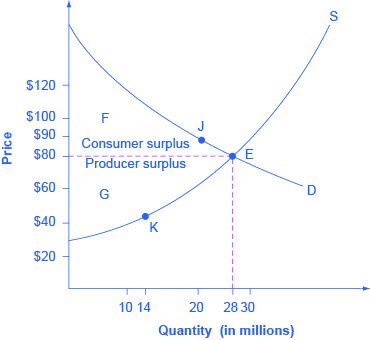

By the end of this section, you will be able to:
* Contrast consumer surplus, producer surplus, and social surplus
* Explain why price floors and price ceilings can be inefficient
* Analyze demand and supply as a social adjustment mechanism

The familiar **demand and supply diagram**{: data-type="term" .no-emphasis} holds within it the concept of economic efficiency. One typical way that economists define **efficiency**{: data-type="term" .no-emphasis} is when it is impossible to improve the situation of one party without imposing a cost on another. Conversely, if a situation is inefficient, it becomes possible to benefit at least one party without imposing costs on others.

Efficiency in the demand and supply model has the same basic meaning: The economy is getting as much benefit as possible from its scarce resources and all the possible gains from trade have been achieved. In other words, the optimal amount of each good and service is being produced and consumed.

# Consumer Surplus, Producer Surplus, Social Surplus

Consider a market for tablet computers, as shown in [\[link\]](#CNX_Econ_C03_015). The equilibrium price is $80 and the equilibrium quantity is 28 million. To see the benefits to consumers, look at the segment of the demand curve above the **equilibrium**{: data-type="term" .no-emphasis} point and to the left. This portion of the demand curve shows that at least some demanders would have been willing to pay more than $80 for a tablet.

For example, point J shows that if the price was $90, 20 million tablets would be sold. Those consumers who would have been willing to pay $90 for a tablet based on the utility they expect to receive from it, but who were able to pay the equilibrium price of $80, clearly received a benefit beyond what they had to pay for. Remember, the demand curve traces consumers’ willingness to pay for different quantities. The amount that individuals would have been willing to pay, minus the amount that they actually paid, is called **consumer surplus**{: data-type="term"}. Consumer surplus is the area labeled F—that is, the area above the market price and below the demand curve.

{: #CNX_Econ_C03_015 data-title="Consumer and Producer Surplus "}

The supply curve shows the quantity that firms are willing to supply at each price. For example, point K in [\[link\]](#CNX_Econ_C03_015) illustrates that, at $45, firms would still have been willing to supply a quantity of 14 million. Those producers who would have been willing to supply the tablets at $45, but who were instead able to charge the equilibrium price of $80, clearly received an extra benefit beyond what they required to supply the product. The amount that a seller is paid for a good minus the seller’s actual cost is called **producer surplus**{: data-type="term"}. In [\[link\]](#CNX_Econ_C03_015), producer surplus is the area labeled G—that is, the area between the market price and the segment of the supply curve below the equilibrium.

The sum of consumer surplus and producer surplus is **social surplus**{: data-type="term"}, also referred to as **economic surplus**{: data-type="term"} or **total surplus**{: data-type="term"}. In [\[link\]](#CNX_Econ_C03_015), social surplus would be shown as the area F + G. Social surplus is larger at equilibrium quantity and price than it would be at any other quantity. This demonstrates the economic efficiency of the market equilibrium. In addition, at the efficient level of output, it is impossible to produce greater consumer surplus without reducing producer surplus, and it is impossible to produce greater producer surplus without reducing consumer surplus.

# Inefficiency of Price Floors and Price Ceilings

The imposition of a price floor or a price ceiling will prevent a market from adjusting to its equilibrium price and quantity, and thus will create an inefficient outcome. But there is an additional twist here. Along with creating inefficiency, price floors and ceilings will also transfer some consumer surplus to producers, or some producer surplus to consumers.

Imagine that several firms develop a promising but expensive new drug for treating back pain. If this therapy is left to the market, the equilibrium price will be $600 per month and 20,000 people will use the drug, as shown in [\[link\]](#CNX_Econ_C03_028) (a). The original level of consumer surplus is T + U and producer surplus is V + W + X. However, the government decides to impose a price ceiling of $400 to make the drug more affordable. At this price ceiling, firms in the market now produce only 15,000.

As a result, two changes occur. First, an inefficient outcome occurs and the total surplus of society is reduced. The loss in social surplus that occurs when the economy produces at an inefficient quantity is called **deadweight loss**{: data-type="term"}. In a very real sense, it is like money thrown away that benefits no one. In [\[link\]](#CNX_Econ_C03_028) (a), the deadweight loss is the area U + W. When deadweight loss exists, it is possible for both consumer and producer surplus to be higher, in this case because the **price control**{: data-type="term" .no-emphasis} is blocking some suppliers and demanders from transactions they would both be willing to make.

A second change from the **price ceiling**{: data-type="term" .no-emphasis} is that some of the producer surplus is transferred to consumers. After the price ceiling is imposed, the new consumer surplus is T + V, while the new producer surplus is X. In other words, the price ceiling transfers the area of surplus (V) from producers to consumers. Note that the gain to consumers is less than the loss to producers, which is just another way of seeing the deadweight loss.

  The original equilibrium price is $600 with a quantity of 20,000. Consumer surplus is T + U, and producer surplus is V + W + X. A price ceiling is imposed at $400, so firms in the market now produce only a quantity of 15,000. As a result, the new consumer surplus is T + V, while the new producer surplus is X. (b) The original equilibrium is $8 at a quantity of 1,800. Consumer surplus is G + H + J, and producer surplus is I + K. A price floor is imposed at $12, which means that quantity demanded falls to 1,400. As a result, the new consumer surplus is G, and the new producer surplus is H + I."){: #CNX_Econ_C03_028 data-title="Efficiency and Price Floors and Ceilings "}

[\[link\]](#CNX_Econ_C03_028) (b) shows a price floor example using a string of struggling movie theaters, all in the same city. The current equilibrium is $8 per movie ticket, with 1,800 people attending movies. The original consumer surplus is G + H + J, and producer surplus is I + K. The city government is worried that movie theaters will go out of business, reducing the entertainment options available to citizens, so it decides to impose a price floor of $12 per ticket. As a result, the quantity demanded of movie tickets falls to 1,400. The new consumer surplus is G, and the new producer surplus is H + I. In effect, the **price floor**{: data-type="term" .no-emphasis} causes the area H to be transferred from consumer to producer surplus, but also causes a deadweight loss of J + K.

This analysis shows that a price ceiling, like a law establishing rent controls, will transfer some producer surplus to consumers—which helps to explain why consumers often favor them. Conversely, a price floor like a guarantee that farmers will receive a certain price for their crops will transfer some consumer surplus to producers, which explains why producers often favor them. However, both price floors and price ceilings block some transactions that buyers and sellers would have been willing to make, and creates deadweight loss. Removing such barriers, so that prices and quantities can adjust to their equilibrium level, will increase the economy’s social surplus.

# Demand and Supply as a Social Adjustment Mechanism

The demand and supply model emphasizes that prices are not set only by demand or only by supply, but by the interaction between the two. In 1890, the famous economist **Alfred Marshall**{: data-type="term" .no-emphasis} wrote that asking whether supply or demand determined a price was like arguing “whether it is the upper or the under blade of a pair of scissors that cuts a piece of paper.” The answer is that both blades of the demand and supply scissors are always involved.

The adjustments of equilibrium price and quantity in a market-oriented economy often occur without much government direction or oversight. If the coffee crop in Brazil suffers a terrible frost, then the supply curve of coffee shifts to the left and the price of coffee rises. Some people—call them the coffee addicts—continue to drink coffee and pay the higher price. Others switch to tea or soft drinks. No government commission is needed to figure out how to adjust coffee prices, which companies will be allowed to process the remaining supply, which supermarkets in which cities will get how much coffee to sell, or which consumers will ultimately be allowed to drink the brew. Such adjustments in response to price changes happen all the time in a market economy, often so smoothly and rapidly that we barely notice them.

Think for a moment of all the seasonal foods that are available and inexpensive at certain times of the year, like fresh corn in midsummer, but more expensive at other times of the year. People alter their diets and restaurants alter their menus in response to these fluctuations in prices without fuss or fanfare. For both the U.S. economy and the world economy as a whole, markets—that is, demand and supply—are the primary social mechanism for answering the basic questions about what is produced, how it is produced, and for whom it is produced.

Why Can We Not Get Enough of Organic?

Organic food is grown without synthetic pesticides, chemical fertilizers or genetically modified seeds. In recent decades, the demand for organic products has increased dramatically. The Organic Trade Association reported sales increased from $1 billion in 1990 to $35.1 billion in 2013, more than 90% of which were sales of food products.

Why, then, are organic foods more expensive than their conventional counterparts? The answer is a clear application of the theories of supply and demand. As people have learned more about the harmful effects of chemical fertilizers, growth hormones, pesticides and the like from large-scale factory farming, our tastes and preferences for safer, organic foods have increased. This change in tastes has been reinforced by increases in income, which allow people to purchase pricier products, and has made organic foods more mainstream. This has led to an increased demand for organic foods. Graphically, the demand curve has shifted right, and we have moved up the supply curve as producers have responded to the higher prices by supplying a greater quantity.

In addition to the movement along the supply curve, we have also had an increase in the number of farmers converting to organic farming over time. This is represented by a shift to the right of the supply curve. Since both demand and supply have shifted to the right, the resulting equilibrium quantity of organic foods is definitely higher, but the price will only fall when the increase in supply is larger than the increase in demand. We may need more time before we see lower prices in organic foods. Since the production costs of these foods may remain higher than conventional farming, because organic fertilizers and pest management techniques are more expensive, they may never fully catch up with the lower prices of non-organic foods.

As a final, specific example: The Environmental Working Group’s “Dirty Dozen” list of fruits and vegetables, which test high for pesticide residue even after washing, was released in April 2013. The inclusion of strawberries on the list has led to an increase in demand for organic strawberries, resulting in both a higher equilibrium price and quantity of sales.

<section data-depth="1" class="summary" markdown="1">
Consumer surplus is the gap between the price that consumers are willing to pay, based on their preferences, and the market equilibrium price. Producer surplus is the gap between the price for which producers are willing to sell a product, based on their costs, and the market equilibrium price. Social surplus is the sum of consumer surplus and producer surplus. Total surplus is larger at the equilibrium quantity and price than it will be at any other quantity and price. Deadweight loss is loss in total surplus that occurs when the economy produces at an inefficient quantity.

</section>

<section data-depth="1" class="self-check-questions">

Does a price ceiling increase or decrease the number of transactions in a market? Why? What about a price floor?

Assuming that people obey the price ceiling, the market price will be above equilibrium, which means that Qd will be less than Qs. Firms can only sell what is demanded, so the number of transactions will fall to Qd. This is easy to see graphically. By analogous reasoning, with a price floor the market price will be below the equilibrium price, so Qd will be greater than Qs. Since the limit on transactions here is demand, the number of transactions will fall to Qd. Note that because both price floors and price ceilings reduce the number of transactions, social surplus is less.

If a price floor benefits producers, why does a price floor reduce social surplus?

Because the losses to consumers are greater than the benefits to producers, so the net effect is negative. Since the lost consumer surplus is greater than the additional producer surplus, social surplus falls.

</section>

<section data-depth="1" class="review-questions">

What is consumer surplus? How is it illustrated on a demand and supply diagram?

What is producer surplus? How is it illustrated on a demand and supply diagram?

What is total surplus? How is it illustrated on a demand and supply diagram?

What is the relationship between total surplus and economic efficiency?

What is deadweight loss?

</section>

<section data-depth="1" class="critical-thinking">

What term would an economist use to describe what happens when a shopper gets a “good deal” on a product?

Explain why voluntary transactions improve social welfare.

Why would a free market never operate at a quantity greater than the equilibrium quantity? *Hint:* What would be required for a transaction to occur at that quantity?

</section>

